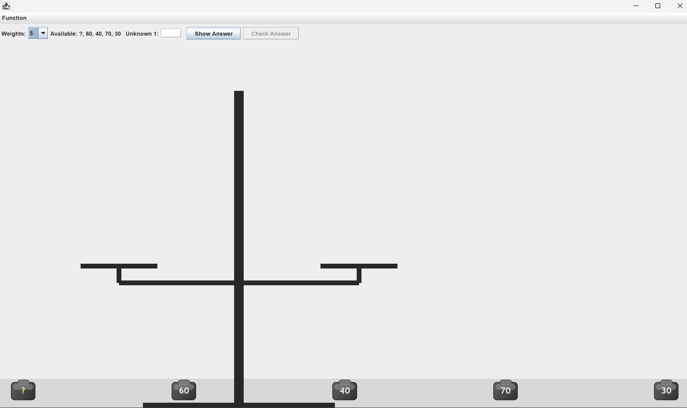
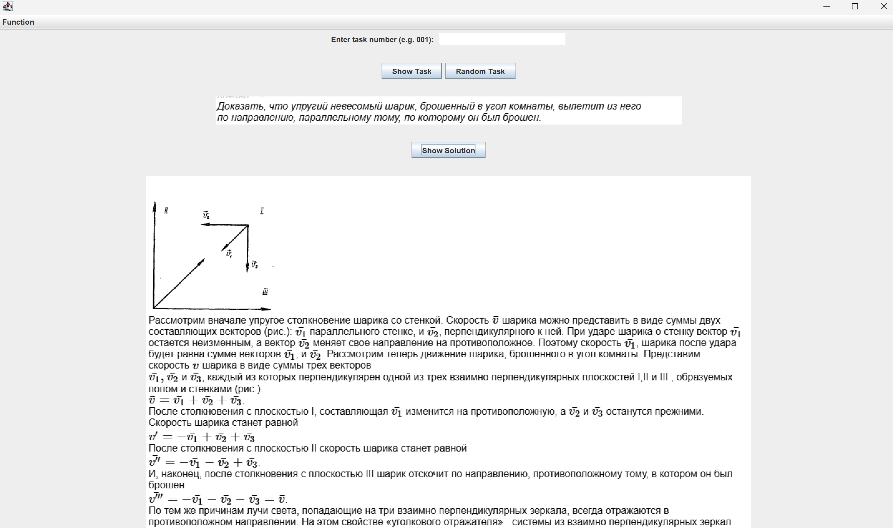
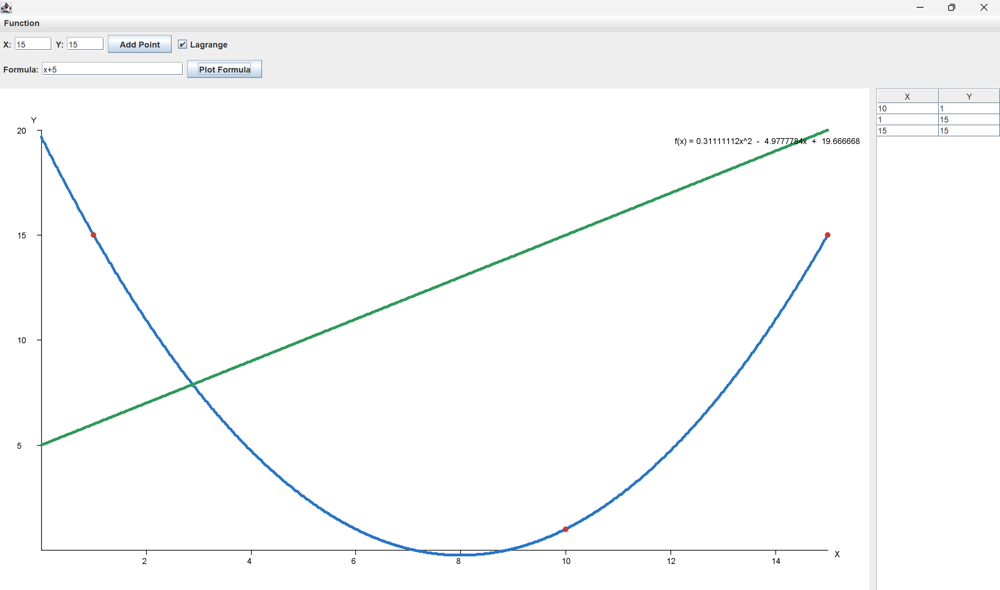
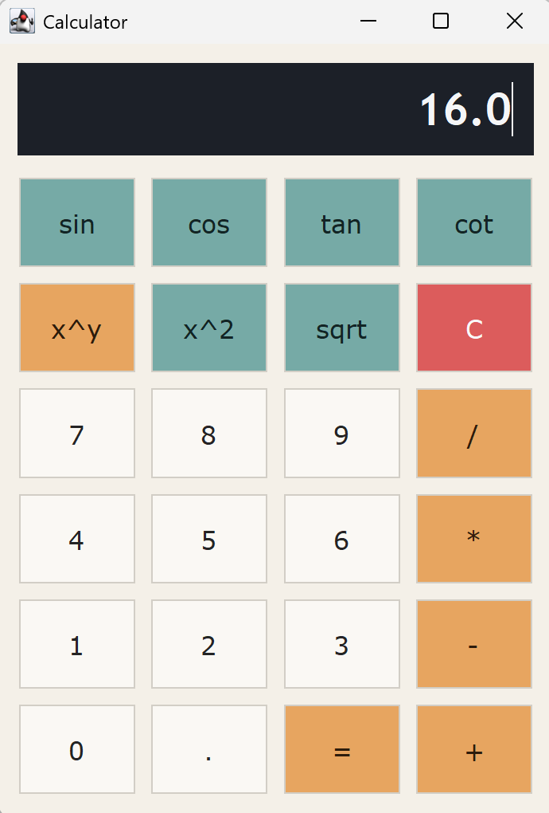

# HelpWithPhysics
test
Небольшое приложение на Java, в котором есть:
 - калькулятор
 - мод, в котором необходимо определить вес неизвестный гирьки с помощью весов и других гирек
 - рисование графика, а также отображение многочлена ЛаГранжа на этом графике
 - решение задач

## Запуск

```powershell
javac -d out (Get-ChildItem -Recurse -Filter *.java | ForEach-Object FullName)
java -cp out app.AppLauncher
```

## Структура проекта

- `app/` запуск приложения
- `ui/` отображение всех элементов
- `model/` модели для различных задач
- `service/` работа приложения





